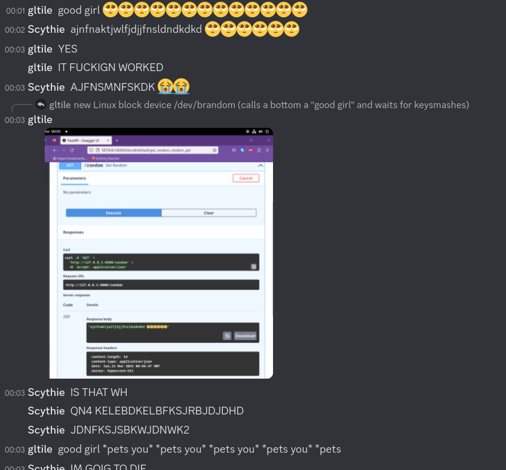

# brandom
A tool for generating "random" strings from bottoms.

> ## Warning
> This application makes use of a Discord selfbot via discord.py-self. Discord selfbots are banned by the Discord Terms of Service.

## Getting started
1. Find a bottom
2. Install an ASGI web server of choice (examples use Hypercorn)
3. Run the bot:
    ```
    $ USER_ID=<id of the bottom you found> TOKEN=<token> hypercorn main:app
    [2023-03-12 00:01:16 +0000] [25877] [INFO] Running on http://127.0.0.1:8000 (CTRL + C to quit)
    Logged on as notarealuser#0000
    ```
4. Make your first request:
    ```
    $ curl -v http://localhost:8000/random
    *   Trying 127.0.0.1:8000...
    * Connected to localhost (127.0.0.1) port 8000 (#0)
    > GET /random HTTP/1.1
    > Host: localhost:8000
    > User-Agent: curl/7.87.0
    > Accept: */*
    > 
    * Mark bundle as not supporting multiuse
    < HTTP/1.1 200 
    < content-length: 88
    < content-type: application/json
    < date: Sun, 12 Mar 2023 00:08:41 GMT
    < server: hypercorn-h11
    < 
    * Connection #0 to host localhost left intact
    "kanfjsjnfkskfhmslahdjskdbwmmsnfbskdj 🥺🥺"
    ```
    or, use the web interface provided by FastAPI at `https://<hostname>/docs`

